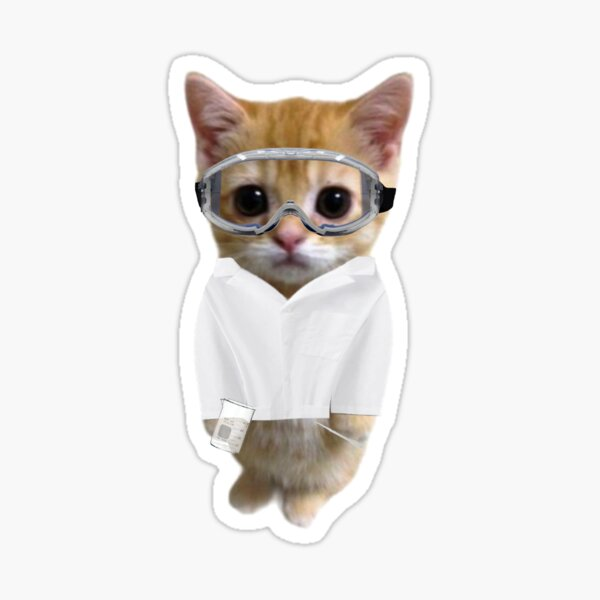

# Personal Laboratory 🧪

  

Bienvenue dans mon laboratoire personnel !

Ce dépôt est mon terrain de jeu, un espace où je peux :
- Tester de nouvelles technologies,
- Apprendre de nouveaux langages,
- M'entraîner à développer des idées,
- Expérimenter, bricoler et parfois casser des choses (volontairement !),
- M'améliorer en explorant sans pression.

Ici, pas de code parfait ni de projet fini : juste l'envie d'apprendre, de m'amuser et de progresser à mon rythme.

Merci de ta visite et bonne exploration ! 🌟

---

**Note** : Ce dépôt évolue au fil de mes envies et de mes découvertes. Certains projets peuvent être inachevés, d'autres purement expérimentaux — et c'est exactement l'objectif ! 🚀

